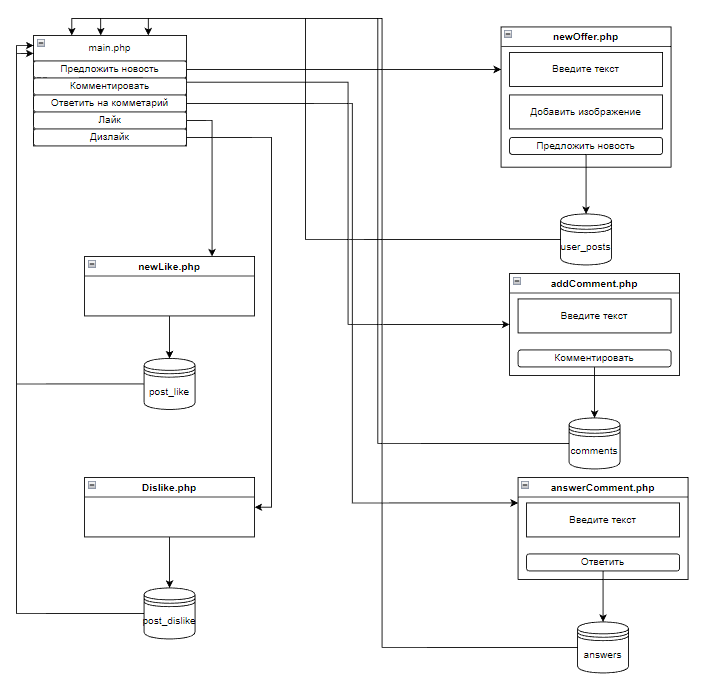

# CRUD
Реализация шаблона CRUD

## Цель работы
Разработать и реализовать клиент-серверную информационную систему, реализующую механизм CRUD.

Система предназначена для общения в сети интернет.
Интерфейс системы представляет собой веб-страницу с лентой заметок, отсортированных вобратном хронологическом порядке и форму добавления новой заметки. В ленте отображаются последние 100 заметок.

В данном проекте реализованы следующие возможности пользователя:
- Формы регистрации/входа
- Добавление текстовых заметок в общую ленту
- Реагирование на чужие заметки (лайки)
- Добавление комментариев к чужим заметкам
- "Расскрывающиеся" комментарии
- Реакции разных видов (лайки/дизлайки)
- Добавление изображений к заметкам
- Комментирование второго уровня

## Ход работы

`CRUD` — акроним, обозначающий четыре базовые функции, используемые при работе с базами данных: создание (create), чтение (read), модификация (update), удаление (delete).

Хореография </br>


---

При входе на сайт пользователь попадает на страницу ***/index.php***, которая является страницей входа на сайт. На данной странице находится форма регистрации и авторизации.
###### 1. **Регистрация/Авторизация**
Механизм авторизации и регистрации подробно описан в **лабораторной работе №1**
###### 2. **/main.php**
Главная страница сайта, на которую пользователь попадает после успешной регистрации или авторизации. Страница содержит интуитивно понятный интерфейс, который включает в себя ленту заметок, а так же кнопку перехода в личный кабинет, при нажатии на которую происходит редирект на **/personality.php**
###### 3. **/personality.php**
Страница личного кабинета пользователя, на которой пользователь может выйти из своей учетной записи при нажатии соответствующей кнопки.
###### 4. **/newOffer.php**
Скрипт, который выполняется при добавлении новой заметки. Он подключается к базе данных и передает туда введенные пользователем текст заметки, изображение (если такое было выбрано), а так же устанавливает по умолчанию колличество лайков и дизлайков равных 0.
###### 5. **Заметка**
Каждая заметка выводится путем подключения к таблице `user_post`, структура которой представлена ниже. Все заметки сортируются в обратном хронологическом порядке с помощью `order by id desc` в SQL запросе. <br/>
Заметки выводтся в цикле, который берет каждую строку в таблице базы данных и выводит ее как отдельный HTML элемент.
###### 6. **Лайки/Дизлайки**
Лайки и дизлайки реализованы с помощью `<form>` которые активируют соответствующие скрипты **/newLike.php** и **/dislike.php**. Скрипты работают одинаково. Каждый скрипт подключается к базе данных, в которой хранится номер поста, id пользователя, который поставил лайк или дизлайк. <br/>
Проверяется какой пользователь активировал скрипт, затем проверяется стоит ли уже у него лайк или дизлайк. Если уже стоит, то скрипт производит запрос в базу данных, который удаляет данную строку и вычитает из числа лайков/дизлайков 1. <br/>
Так как не использована технология `AJAX`, то страница перезагружается и выводится обновленное кол-во этих элементов. <br/>
Так же при нажатии на лайк проверяется стоит ли у пользователя дизлайк, если да то путем запросов к базе данных дизлайк удаляется и ставится лайк.
**Для дизлайка процедура точно такая же**
###### 7. **Комментарии**
Комментарии так же как и заметки выводятся циклом в отдельную переменную для каждой заметки. Далее путем конкатенации с переменной самой заметки выводится единая переменная, содержащая HTML разметку. В конце цикла переменная содержащая комментарии очищается, чтобы для следующих заметок не было комментариев из предыдущей заметки. </br>
Добавление нового комментария происходит путем записи текста в соответствующую форму, которая вызывает скрипт ***/addComment.php***, который подключается к базе данных и записывает туда id поста, к которому был оставлен комментарий, id пользователя, который оставил комментарий, и текст комментария.
###### 8. **Комментарии II уровня**
Комментарии 2 уровня аналогично простым комментария выводятся циклом для каждого комментария. И добавление нового комментария к комментария происходит по аналогии. 
###### 9. **Расскрывающиеся комментарии**
Расскрывающиеся комментарии реализованы с помощью `JavaScript`:
```javascript
let acc = document.getElementsByClassName("comments__btn");
for (i = 0; i < acc.length; i++) {
    acc[i].addEventListener("click", function() {
        this.classList.toggle("active");
        let panel = this.nextElementSibling;
        if (panel.style.display === "block") {
            panel.style.display = "none";
        } else {
            panel.style.display = "block";
        }
    });
}
```
###### 10. **Добавление изображений к заметкам**
Изображения, добавленные к заметкам хранятся в базе данных в `longblob` переменной. </br>
При выводе каждой заметки проверяется содержит ли заметка изображение. Если заметка содержит изображение, то `longblob` переменная возвращает данные, кодированные методом `base64` и выводится в заметке.

---

### База данных

#### `users`

| id | mail | login | pass |

В этой таблице:

- **id** - уникальный идентификатор пользователя (int);

- **mail** - почта пользователя (varchar(100));

- **login** - имя пользователя (varchar(100));

- **pass** - хэш пароля (varchar(60));

Таблица используется для хранения всех зарегистрированных пользователей.

#### `user_post`

| id | user | text | likes | dislikes | image |

В этой таблице:

- **id** - уникальный идентификатор заметки (int);

- **user** - имя пользователя(автора), кто написал заметку (varchar(100));

- **text** - текст заметки (text);

- **likes** - колличество лайков для данного поста (int(100));

- **image** - изображение для данного поста (longblob);

Таблица используется для хранения заметок.

#### `posts_like`

| id_post | id_user | 

В этой таблице:

- **id_post** - идентификатор поста к которому был поставлен лайк (varchar(255));

- **id_user** - идентификатор пользователя который поставил лайк (varchar(255));

Таблица используется для хранения пользователей, которые поставили лайки к конкретным постам.

#### `posts_dislike`

| id_post | id_user |

В этой таблице:

- **id_post** - идентификатор поста к которому был поставлен дизлайк (varchar(255));

- **id_user** - идентификатор пользователя который поставил дизлайк (varchar(255));

Таблица используется для хранения пользователей, которые поставили дизлайки к конкретным постам.

#### `comments`

| id | post_id | user_id | comment |

В этой таблице:

- **id** - уникальный идентификатор комментария (int(11));

- **post_id** - идентификатор поста, к которому был написан комментарий (varchar(255));

- **user_id** - идентификатор пользователя, который оставил этот комментарий (varchar(255));

- **comment** - текст комментария (varchar(255));

Таблица используется для хранения всех комментариев к каждому посту.

#### `answers`

| id | comment_id | user_id | answer |

В этой таблице:

- **id** - уникальный идентификатор ответа к комментарию (int(11));

- **comment_id** - идентификатор комментария, к которому был написан ответ (varchar(255));

- **user_id** - идентификатор пользователя, который оставил ответил на комментарий (varchar(255));

- **answer** - текст ответа комментарию (varchar(255));

Таблица используется для хранения всех ответов к каждому комментарию.

### Вывод
Разработал и реализовал клиент-серверную информационную систему, реализующую механизм CRUD.
